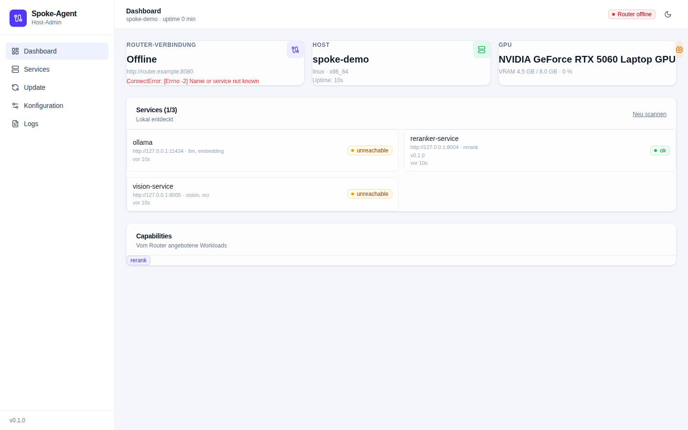
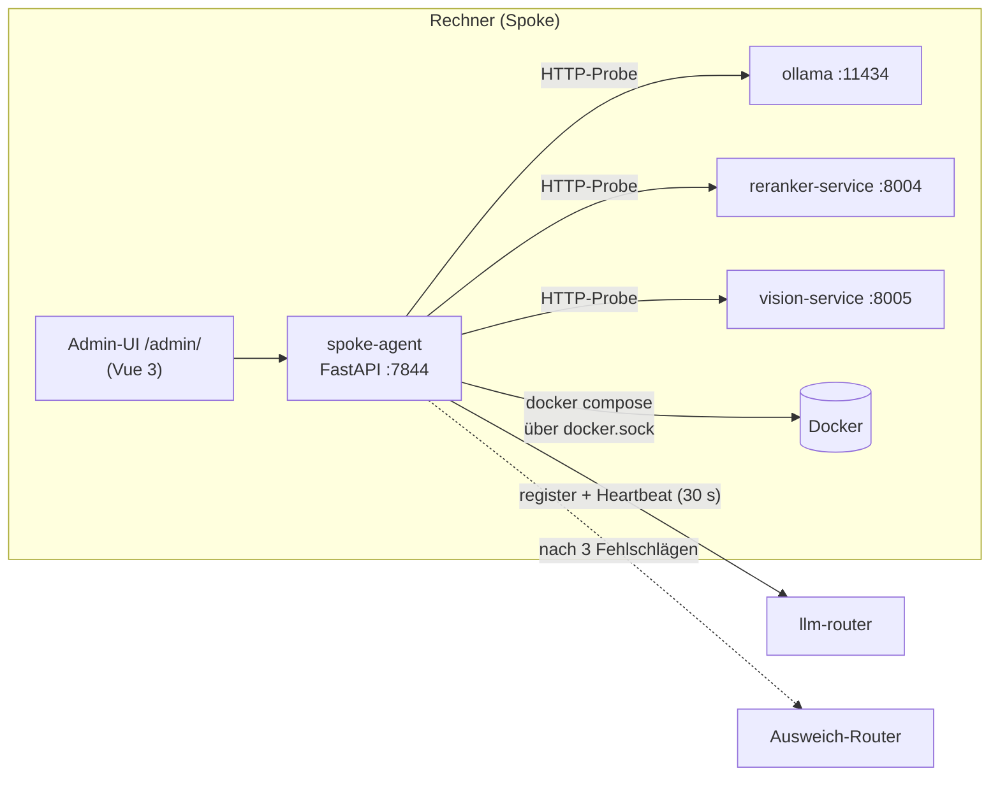

# spoke-agent

[](https://github.com/janpow77/spoke-agent/actions/workflows/image.yml)


**Agent, der auf jedem Rechner eines LLM-Router-Verbunds läuft: Er findet die lokalen ML-Dienste (Ollama, Reranker, Vision), meldet den Rechner als Spoke beim zentralen [`llm-router`](https://github.com/janpow77/llm-router) an und bietet eine Admin-Oberfläche für die zugehörigen Docker-Container.**

<picture>
  <source media="(prefers-color-scheme: dark)" srcset="docs/assets/dashboard-dark.png">
  
</picture>

## Auf einen Blick

- **Dienste finden:** prüft per HTTP, ob Ollama (`:11434`), `reranker-service` (`:8004`) und `vision-service` (`:8005`) lokal antworten, und leitet daraus die Fähigkeiten des Rechners ab (`llm`, `embedding`, `rerank`, `vision`, `ocr`).
- **GPU erkennen:** NVIDIA über `nvidia-smi`, AMD über `rocm-smi`/`rocminfo`, Apple über `system_profiler`.
- **Beim Router anmelden:** `POST <router>/admin/api/spokes/register` mit Status-Payload, danach Heartbeat alle 30 s; nach drei Fehlschlägen Wechsel auf einen Ausweich-Router.
- **Container steuern:** `docker compose restart/stop/start` und `pull` + `up -d` über den eingehängten Docker-Socket, Logs auch live per WebSocket.
- **Admin-Oberfläche:** Vue-3-SPA unter `/admin/` mit den Ansichten Dashboard, Services, Update, Konfiguration und Logs.

## Architektur



Den kompletten Compose-Stack mit allen vier Diensten liefert [`spoke-stack`](https://github.com/janpow77/spoke-stack); die Tray-App für den Desktop ist [`spoke-widget`](https://github.com/janpow77/spoke-widget).

## Schnellstart

Voraussetzungen: Python ≥ 3.12, Node.js (für die Oberfläche), optional Docker.

```bash
# Backend
pip install -e .[dev]
uvicorn spoke_agent.main:app --reload --port 7844

# Frontend (zweites Terminal)
cd frontend
npm install
npm run dev   # http://localhost:5182, leitet /api und /health an :7844 weiter
```

Ohne gesetztes `SPOKE_AGENT_ADMIN_PASSWORD` gilt das Passwort `spoke-admin` (nur für lokale Tests). Prüfen, ob der Agent läuft:

```bash
curl -s http://localhost:7844/health
# {"status":"ok","version":"0.1.0","spoke_name":"…","uptime_s":0,"router_connected":false}
```

Als Container (Image aus der CI: `ghcr.io/janpow77/spoke-agent`):

```bash
docker build -t spoke-agent .
docker run -d -p 7844:7844 \
  -v /var/run/docker.sock:/var/run/docker.sock:ro \
  -e ROUTER_URL=http://<router>:8080 -e SPOKE_AGENT_ADMIN_PASSWORD=<passwort> \
  spoke-agent
```

Das Image baut die Oberfläche mit (Node 20) und liefert sie aus `/app/frontend_dist` aus; persistente Einstellungen liegen unter `/data`.

<details><summary><b>Konfiguration (Umgebungsvariablen)</b></summary>

Die Konfiguration kommt ausschließlich aus Umgebungsvariablen (Vorlage: [`.env.example`](.env.example)); eine YAML-Datei gibt es nicht. Was in der Oberfläche geändert wird (Router-URL, API-Key, Tags), speichert der Agent im OS-Schlüsselbund oder, falls keiner verfügbar ist, unter `$SPOKE_AGENT_STATE_DIR`.

| Variable | Default | Zweck |
|---|---|---|
| `SPOKE_NAME` | `$HOSTNAME` | Name des Spokes im Router |
| `SPOKE_TAGS` | leer | Tags, kommagetrennt (z. B. `gpu,linux`) |
| `APP_ID` | leer | optionale App-ID für den Router |
| `ROUTER_URL` | interne Adresse <!-- TODO: Code-Default in config.py ist eine private Netzadresse; für eigenen Betrieb immer setzen --> | Primärer Router |
| `FALLBACK_ROUTER_URL` | — | Ausweich-Router nach 3 Fehlschlägen in Folge |
| `API_KEY` | — | Bearer-Token für Aufrufe an den Router |
| `SPOKE_REGISTRATION_TOKEN` | — | Header `X-Spoke-Token` bei der Registrierung |
| `DOCKER_COMPOSE_PATH` | `/etc/spoke-stack/compose.yaml` | Compose-Datei des Spoke-Stacks |
| `SPOKE_AGENT_STATE_DIR` | `/data` | Ablage für Zustand und Overrides |
| `SPOKE_AGENT_ADMIN_PASSWORD` | `spoke-admin` | Login-Passwort der Oberfläche |
| `SPOKE_AGENT_AUTH` | `on` | `off` schaltet den Login ab – nur in abgeschotteten privaten Netzen |
| `SPOKE_AGENT_BIND` / `SPOKE_AGENT_PORT` | `0.0.0.0` / `7844` | Bind-Adresse und Port |
| `SPOKE_REGISTER_INTERVAL_S` | `30` | Heartbeat-Intervall |
| `SPOKE_DISCOVERY_INTERVAL_S` | `15` | Discovery-Intervall |
| `SPOKE_MAX_BACKOFF_S` | `60` | maximaler Backoff bei Fehlern |
| `LOG_LEVEL` | `INFO` | Log-Level |

Kennt der Router den Pfad `/admin/api/spokes/register` nicht, fällt der Agent auf `/admin/api/spokes` zurück.

In der Oberfläche editierbar sind je Dienst nur freigegebene Variablen, damit keine Secrets aus der Container-Umgebung angezeigt werden – etwa `OLLAMA_KEEP_ALIVE`, `OLLAMA_NUM_PARALLEL`, `RERANKER_DEVICE`, `VISION_DEVICE` (vollständige Liste: `SERVICE_EDITABLE_ENV` in [`src/spoke_agent/discovery.py`](src/spoke_agent/discovery.py)).

</details>

<details><summary><b>HTTP-API</b></summary>

| Methode | Pfad | Zweck |
|---|---|---|
| GET | `/health` | Liveness-Check (ohne Auth) |
| POST | `/api/auth/login` | Login (`{"password": "..."}`) |
| POST | `/api/auth/logout` | Token widerrufen |
| GET | `/api/auth/me` | Sitzungsinfo |
| GET | `/api/status` | Agent-, Discovery- und Router-Status |
| GET | `/api/services` | Liste aller entdeckten Dienste |
| POST | `/api/services/refresh` | Discovery sofort neu ausführen |
| POST | `/api/services/{name}/restart` | `docker compose restart` |
| POST | `/api/services/{name}/stop` | `docker compose stop` |
| POST | `/api/services/{name}/start` | `docker compose start` |
| GET | `/api/services/{name}/logs?tail=200` | `docker logs --tail N` |
| GET/PUT | `/api/services/{name}/config` | Dienst-Umgebung (Whitelist je Typ) |
| GET/PUT | `/api/router` | Router-URL, API-Key, Tags |
| POST | `/api/update` | `docker compose pull` + `up -d` |
| WS | `/api/logs/stream` | Live-Logs aller Dienste |
| GET | `/admin/*` | Admin-Oberfläche (SPA) |

</details>

<details><summary><b>Entwicklung, Tests und CI</b></summary>

```bash
pip install -e .[dev]
pytest -q
ruff check src tests

cd frontend
npm run build          # vue-tsc --noEmit + vite build
npm run type-check     # nur vue-tsc
```

Der Workflow [`image.yml`](.github/workflows/image.yml) läuft bei Push und Pull Request auf `master`/`main`: zuerst `ruff check` und `pytest -q`, danach Docker-Build und Push nach `ghcr.io/janpow77/spoke-agent` (bei Pull Requests ohne Push).

</details>

## Dokumentation

- [ARCHITEKTUR.md](ARCHITEKTUR.md) – Modulkarte und zentrale Bausteine (aus dem Code-Graphen erzeugt)
- [CLAUDE.md](CLAUDE.md) – Kontext für KI-Agenten: Stack, Befehle, Struktur, Konventionen

Verwandte Repos: [spoke-stack](https://github.com/janpow77/spoke-stack) · [spoke-widget](https://github.com/janpow77/spoke-widget) · [llm-router](https://github.com/janpow77/llm-router)

## Lizenz

<!-- TODO: Keine LICENSE-Datei im Repo; pyproject.toml nennt "Proprietary". -->
Keine Lizenzdatei vorhanden; `pyproject.toml` weist das Paket als proprietär aus.
